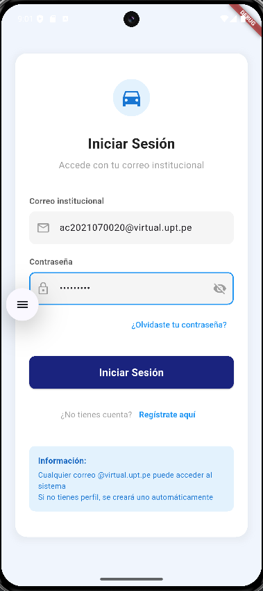
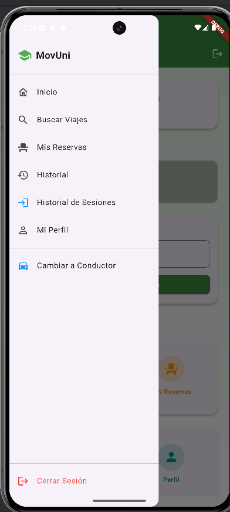
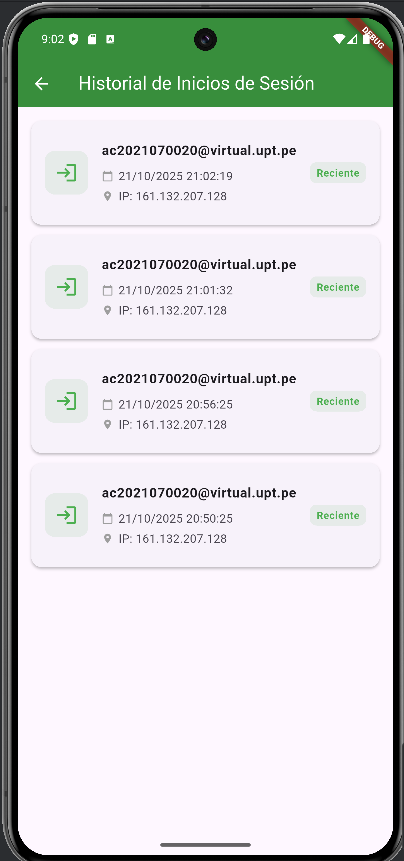

# SM2 - Examen Práctico Unidad II

## Datos del Estudiante
- **Curso:** Soluciones Móviles II
- **Alumno:** Alvaro Javier Contreras Lipa
- **Fecha:** 21/10/2025
- **Repositorio GitHub:** https://github.com/AlvaroContreras13/SM2_EXAMEN_PRACTICO

---

## Historia de Usuario

> **Como usuario autenticado, quiero ver un historial de mis inicios de sesión, para saber cuándo y desde qué dispositivo accedí a mi cuenta.**

### Criterios de Aceptación

- Al iniciar sesión exitosamente, se registra el usuario, la fecha y hora del inicio, así como la dirección IP desde donde inició sesión.
- En la sección **"Historial de inicios de sesión"**, el usuario puede ver una lista con:
  - Usuario
  - Fecha y hora del inicio de sesión
  - IP
- Los registros se muestran ordenados del más reciente al más antiguo.

---

## Funcionalidad Implementada

Se desarrolló un módulo de historial de inicio de sesión que permite:

1. **Registrar automáticamente** cada inicio de sesión exitoso con:
   - Usuario autenticado
   - Fecha y hora de inicio
   - IP o dispositivo
2. **Mostrar al usuario autenticado** su historial en una pantalla propia.
3. **Ordenar el historial** del más reciente al más antiguo.

---

## Evidencias (Capturas de Pantalla)

